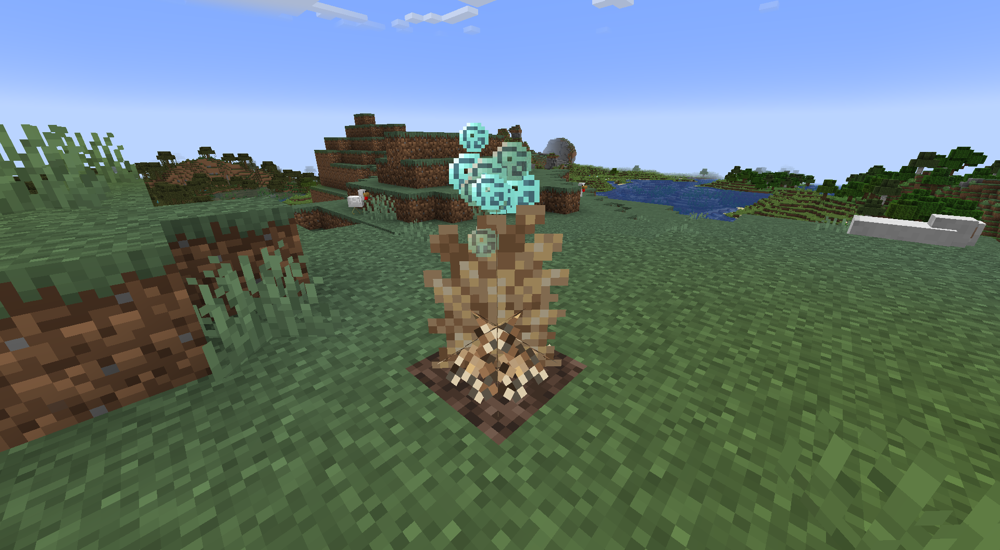

Коралловый Росток можно скрафтить вот так:

TODO: recipe

Коралловый Росток - это начало любой ТАРДИС. Его можно поставить только на блок Песка Душ внутри чанка Разломов, где он начнет расти. Коралловый Росток растет по стадиям, как и ванильные растения  (этот процесс можно ускорить, изменив значение random tick speed в правилах игры). Поставив этот блок, вы получите достижение [Гуру Садоводства](../advancement/gardening-guru).
