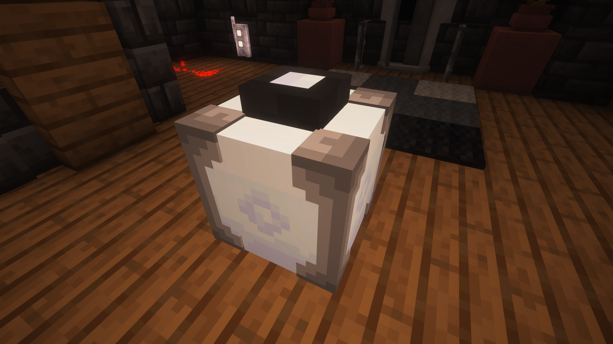
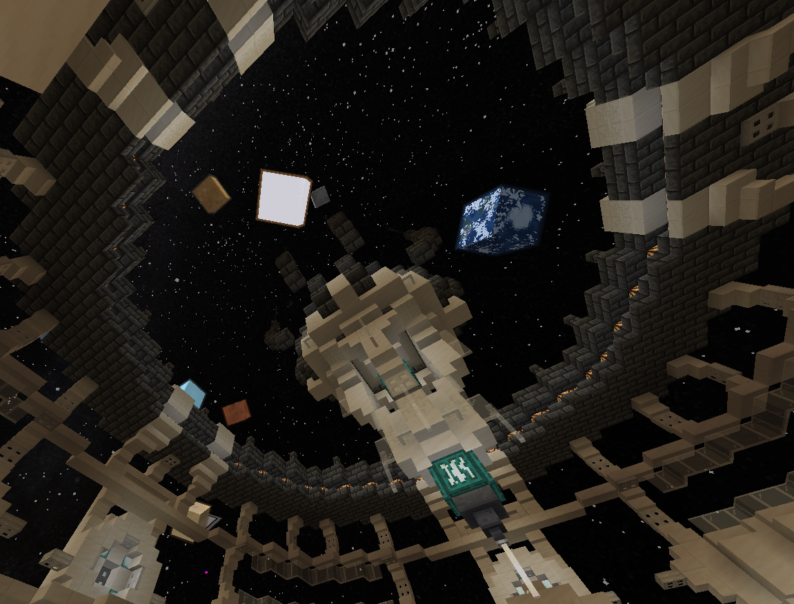

Проектор Окружения можно скрафтить вот так:

TODO: recipe for projector

Проектор Окружения - это забавный способ поменять скайбокс в интерьере своей ТАРДИС, идеально подходящий для интерьеров со стеклянной крышей или эффектных окон, наполненных ослепительными завесами.

Этот блок позволяет показывать скайбокс любого измерения, \*\*\*как показано ниже\*\*\* (Даже работает с другими измерениями из модов! Если они их правильно настроили...):

## Как мне использовать Проектор Окружения?

Нажатие `ПКМ` включает и выключает Проектор Окружения. Нажатие `ПКМ` при удерживании кнопки `SHIFT` по Проектору Окружения позволит вам посмотреть и выбрать варианты доступных скайбоксов. Этот блок может работать только в ТАРДИС и будет контролировать скайбокс конкретно этого \*\*интерьера\*\*.
