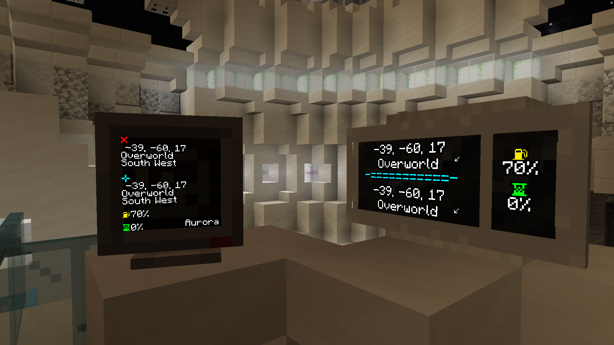

The **Monitor** is your way to change settings, customise your TARDIS and view TARDIS info. A monitor is integrated within most TARDIS [**Consoles**](../tardis/console/), but you can craft it as a separate block and use it anywhere in your interior rather than just your [**Console**](../tardis/console/). There are two types of Monitor: **Regular Monitor** and **Wall Monitor**.

These can be crafted like so:

## Customizing Your TARDIS 

In the monitor’s GUI you can customise your TARDIS, like the Exterior, Desktop Theme, Hum, Vortex, etc.

## Information on Regular Monitor block 

The information displayed on the Monitor’s front face consists of:

- Current location at the top (marked with a ❌), divided into coordinates, dimension and direction the TARDIS is facing.
- Destination location below that (marked with a blue ➕), divided into coordinates, dimension and direction the TARDIS will be facing.
- A yellow fuel icon at the bottom, with a percentage next to it indicating how much [**Artron Energy**](../tardis/artron-energy/) is left.
- A green hourglass below that, with a percentage next to it indicating flight progress.
- The name of the TARDIS in the lower right.
- A red alert icon in the top-right if alarms are active.

## Information on Wall Monitor block 

The information displayed on the Wall Monitor’s front face is split into two sections: Left section:

- The top shows the current location, divided into coordinates, dimension and direction (the little arrow) the TARDIS is facing.
- The bottom shows the destination location, divided into coordinates, dimension and direction (the little arrow) the TARDIS will be facing.

Right section:

- A yellow fuel icon at the top, with a percentage below it indicating how much [**Artron Energy**](../tardis/artron-energy/) is left.
- A green hourglass at the bottom, with a percentage below it indicating flight progress.
