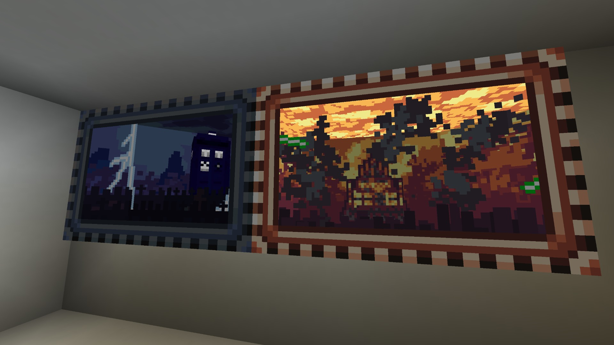
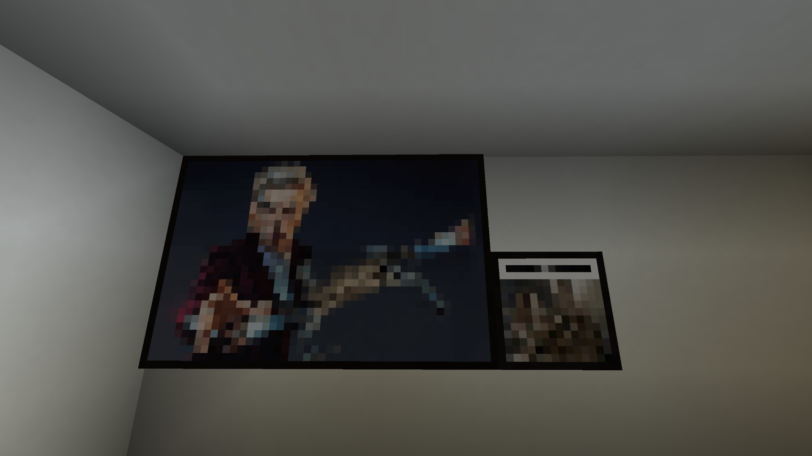

В моде Приключения Во Времени всего 4 картины: картина "Галлифрей пал" и картина Трензалора, имеющие эффект "больше внутри, чем снаружи", и две обычные: Арахис и Метатель Крабов. Картины с эффектом "больше внутри, чем снаружи" можно скрафтить вот так:

TODO: recipe for gallifrey falls painting and recipe for trenzalore painting

# **Картина "Галлифрей пал"**

**"Вот тут ты ошибся. Это одно название: "Галлифрей больше не падет”" - Куратор**

Картина с эффектом "больше внутри, чем снаружи", основанная на одной сцене из спецвыпуска "[День Доктора](https://tardis.wiki/wiki/The_Day_of_the_Doctor_(TV_story))".

# Картина Трензалора 

**"Когда ТАРДИС умирает, иногда барьеры между измерениями рушатся. Они раньше называли это "Утечкой измерений" . Все то, "что больше внутри", начинает вытекать наружу и разрастаться." - Одиннадцатый Доктор.**

Картина с эффектом "внутри больше, чем снаружи", основанная на видах планеты Трензалор из спецвыпуска "[Имя Доктора](https://tardis.wiki/wiki/The_Name_of_the_Doctor_(TV_story))".
