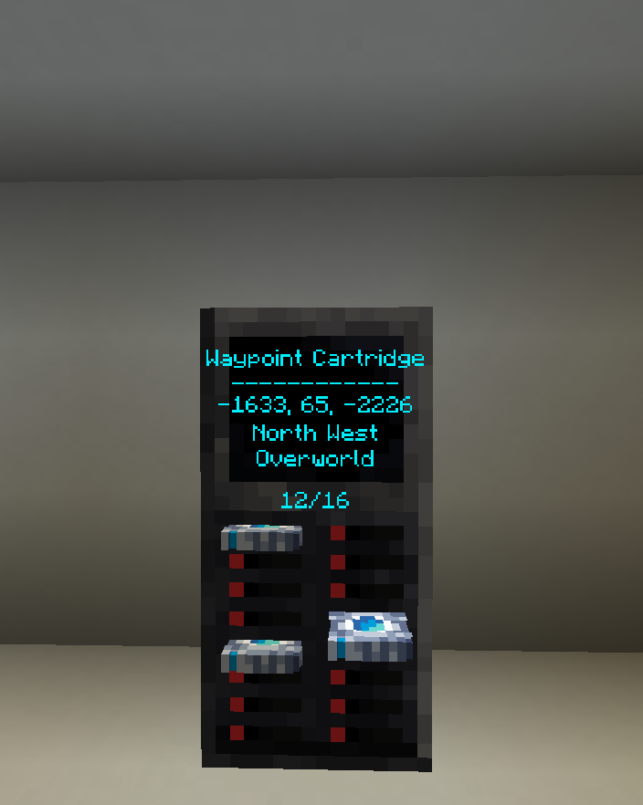

The waypoint bank can be crafted like so:

TODO: add recipe for waypoint bank

The Waypoint Bank is an easy way to fix your storage issues with waypoint cartridges.  
Just put them in and remotely activate them from anywhere in the **TARDIS**!

The Waypoint Bank has 16 slots, into which you can insert a Waypoint Cartridge by interacting with `right-clicking` one of the free slots while holding a (non-empty) cartridge in your hand.

Here are all the ways to interact with the Waypoint Bank:

- Get your waypoint cartridge and then simply `right-click` it onto a free slot to insert it.
- `Right-click` a slot to pull a fully inserted cartridge half-way out. This will display the cartridge's info on the screen.
- `Right-click` that same slot again to load the waypoint and set it as the new destination.
- Crouch and `right-click` the slot of a half-way out cartridge to pull it fully out.
- `Right-click` on a different slot to half-way pull out a different cartridge. (The previously half-way pulled out cartridge will be pushed back in.)
- `Left-click` *anywhere* on the lower block of the Waypoint bank to push the cartridge fully back in.
