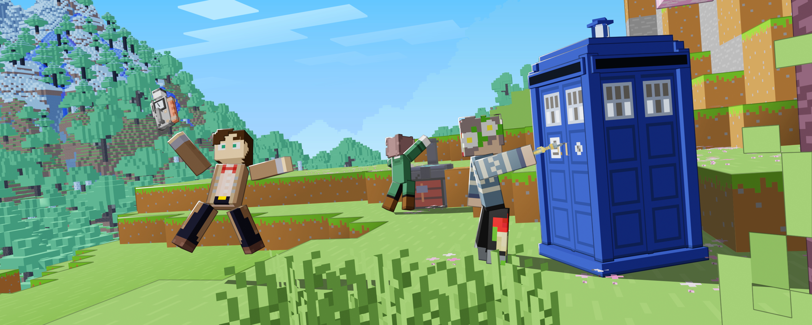

Welcome to the **Adventures in Time** wiki! This wiki is constantly maintained to be up-to-date with the most recent version of the mod!

## Where can I get the mod?

AiT can be found on [Modrinth](https://modrinth.com/mod/adventures-in-time) and [Curseforge](https://www.curseforge.com/minecraft/mc-mods/adventures-in-time).

## AiT is Awesome! Where can I talk about it and show off my creations?

You can join the [Amble Labs Discord Server](https://discord.gg/ZXQdFxTNKh) to chat with the AiT community, see sneak peaks for all our mods, show off creations, and play on the AmbleLabs Server!

## I found a bug where can I report it?

If you find any bugs / crashes, please create a [GitHub Issue](https://github.com/amblelabs/ait/issues/new?template=1-bug-report.yaml) or ask for help in the support channel in the [Amble Labs Discord](https://discord.gg/ZXQdFxTNKh).

## Where should I start?

TODO: Links to stuff *Tardis creation, blocks, yata yata etc.*

