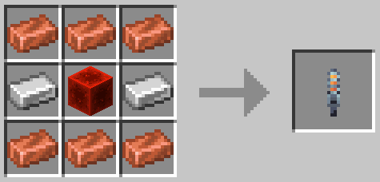

To use it, you'll need to `right click` the [Artron Collector](../block/artron-collector.mdx) and fill the unit up with artron energy. With the artron collector unit in hand, you can `shift` + `right click` on the console block to refuel the TARDIS.

The Artron Collector Unit is crafted with 6 Copper Ingots, 2 Iron Ingots, and 1 Block of Redstone like so:

