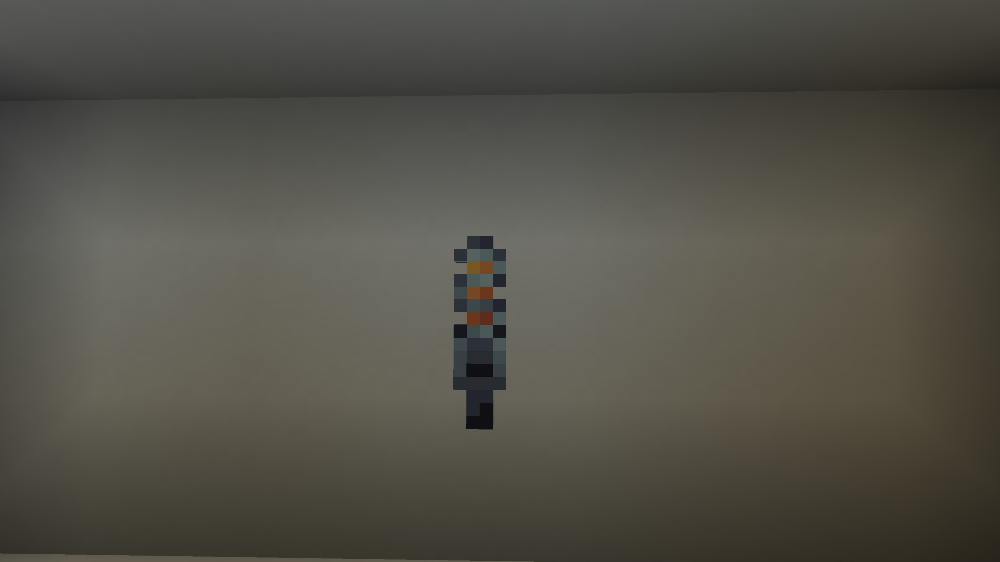

The Artron Collector Unit is crafted like so:

TODO: recipe for artron collector unit

To use it, you'll need to `right click` the [Artron Collector](../block/artron-collector) and fill the unit up with artron energy. With the artron collector unit in hand, you can `shift` + `right click` on the console block to refuel the TARDIS.
