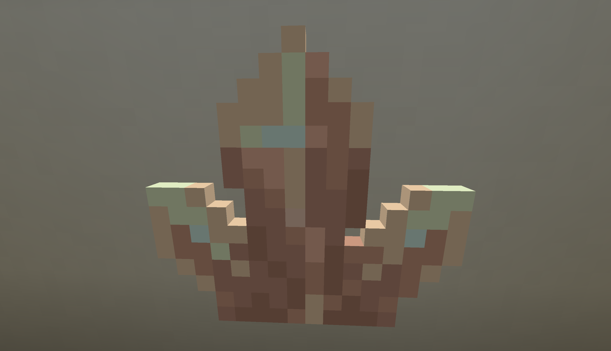

Заряженный Зейтон можно скрафтить вот так:

TODO: recipe for charged zeiton

## Как его использовать?

Чтобы его использовать, просто держите предмет в руке и нажмите `ПКМ`
по Блоку Сборщика Артрона и Заряженный Зейтон опустошит блок. Чтобы заполнить свою ТАРДИС взятой энергией,  нажмите`SHIFT` + `ПКМ` по основанию Консоли.

В подсказке блока также указано, что он может хранить 5000 единиц Артронной Энергии.

## Почему я не могу использовать обычный Зейтон?

Обычный Зейтон не был модифицирован так, чтобы хранить Артронную Энергию.
