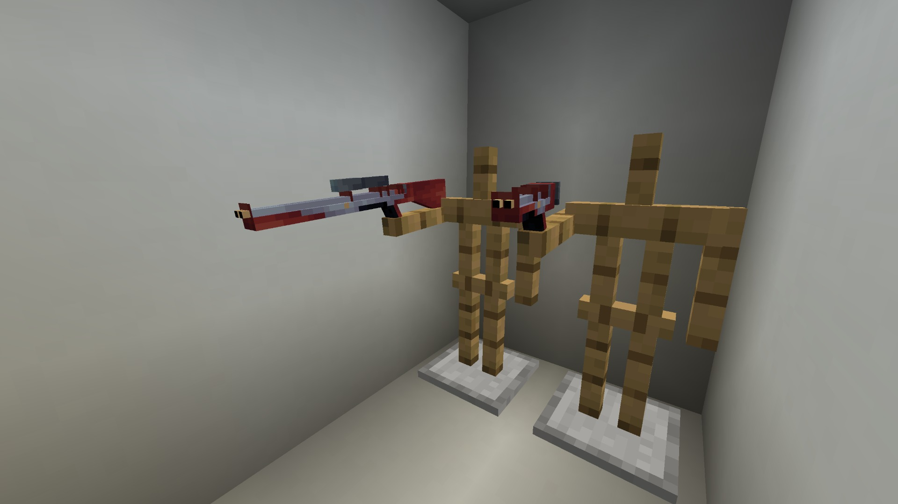

There are 2 types of cult stasers, the cult staser and the cult staser rifle. These cannot be crafted.

The difference here is that the rifle has a scope which can zoom in for long range attacks. You'll need to fill them up with artron energy by using the **Staser Bolt Magazine**.  

First, use `right click` with the magazine in hand on the console port in your TARDIS to fill the  magazine up. Second, in the inventory, grab the magazine, hover over the staser and `right click` to charge it.

To use the staser, `left click` to shoot a powerful beam and hold `right click` to zoom in on your target.

All of the items mentioned here can be found in Cult Structure chests and Cyber wreck chests.
