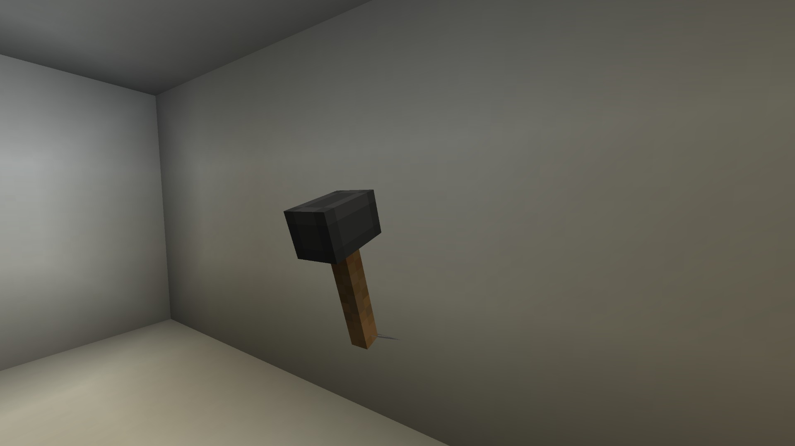

The mallet can be crafted like so:

TODO: recipe for mallet

## Stats

When you put the Hammer in your main hand:

- 6 Attack Damage
- 1.6 Attack Speed (Same as a Iron Sword)

## Functions
The mallet is used to speed up the TARDIS by hitting the console using `right click`. We suggest you hit the base of the console as to not accidentally hit any controls.

**WARNING: The more you hit the TARDIS, the more the TARDIS dislikes you and so loyalty will drop.**

When The Hammer is renamed to the “Toymaker Hammer” the model changes the a bigger and taller version that matches a similar Hammer in the show for the 3rd Episode of the 60th Anniversery of **Doctor WHO**.
