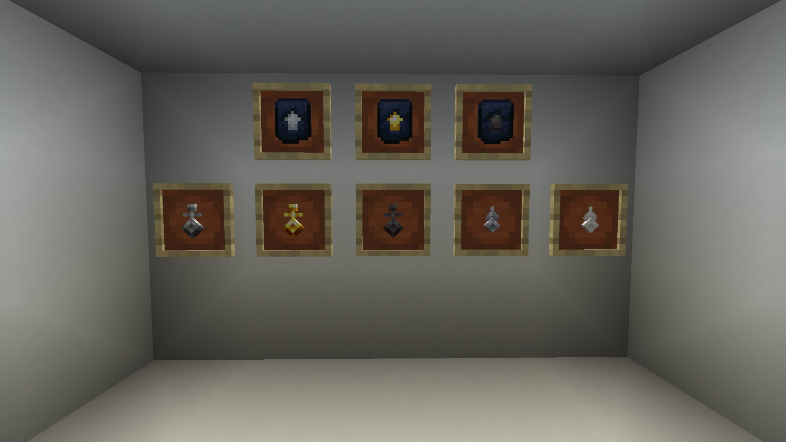

## What keys are there?

- Iron
- Gold
- Netherite
- Classic
- Skeleton

## What do they do?

Everything after iron unlocks snapping if you have the PILOT rank loyalty. Each rank of key increases the snapping range aside from iron, which doesn’t give the ability to snap.

To snap, you simply press the `V` key or whatever key that's bound to snapping.

You can also lock the door by holding `shift` and pressing the `V` key at the same time.

## How do I bind my key?

To bind a key to your TARDIS you need to right-click it with the telepathic circuits.  
**Note**: The Skeleton Key is creative only and can unlock any TARDIS.

## Key recipes:

TODO: keys recipes

## Key Upgrade Template recipes:

TODO: recipe for the templates
