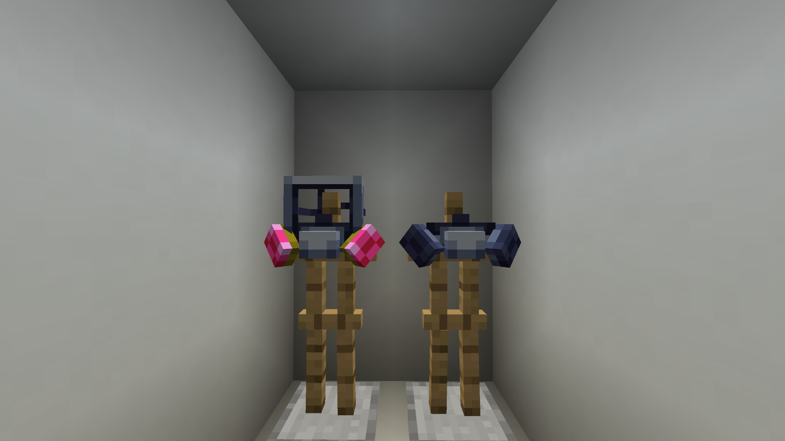

There are 2 types of respirators, the normal one and the faceless one, and can be crafted like so:

The 2 respirators do the same thing, its for breathing in environments without oxygen or toxic environments, such as when you have crashed the TARDIS or before you have set up life support. The normal respirator will also allow you to see through the smog when the TARDIS is crashed(Also yes the “normal” respirator is a breaking bad reference.)
