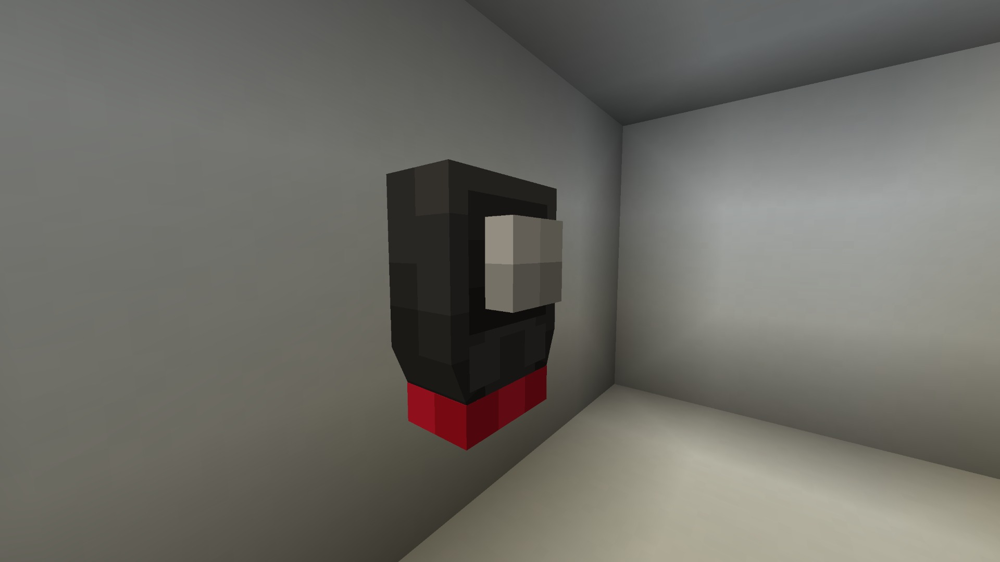

You can craft the Stattenheim Remote like so:

To use it, first you'll have to link it to the TARDIS by `right clicking` on the telepathic circuits.
Then, you can go outside and right click on the ground to summon your TARDIS.

To see how close the TARDIS is getting, you can hover over the remote in the inventory to see a percentage, and by holding `shift`, you can see which TARDIS is the remote bound to.
