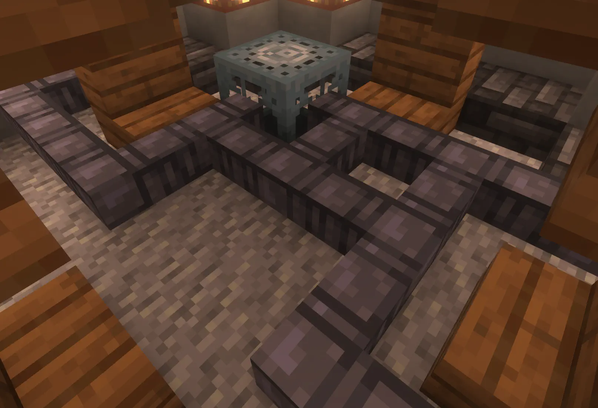
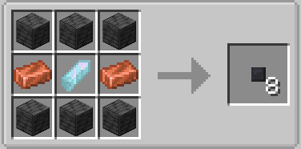

## How Do I Use Them?

Artron Cables are used to connect Generalized Subsystem Cores to the TARDIS’ engine. You don’t need to connect every core separately. If core blocks are touching, they can be connected to the engine as one group.

## How Do I Craft Them?

8 Artron Cables is crafted like so:

