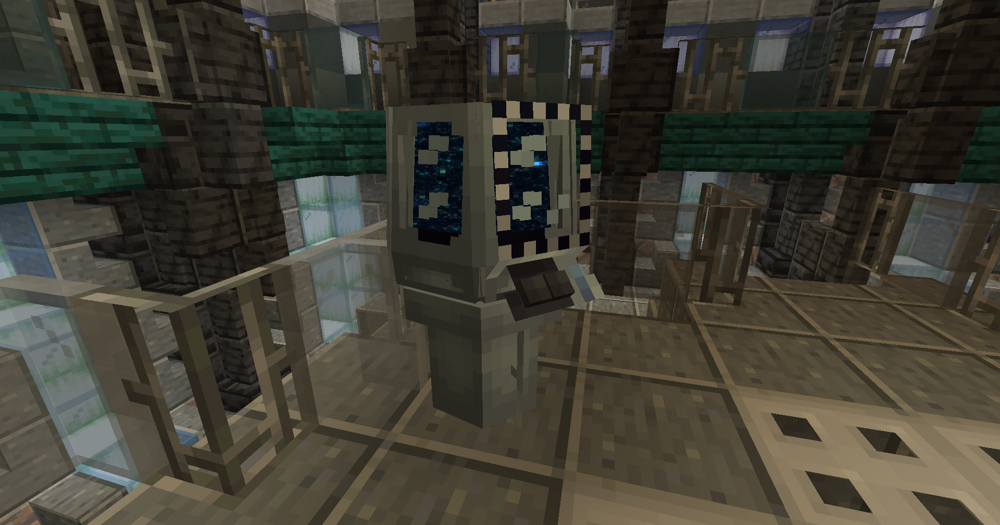

An Astral Map is crafted like so:

TODO: recipe

Astral Maps let you select and locate various structures located throughout your world including modded structures. These structures can include:

- Cult Stuctures
- Ancient Cities
- Villages
- More

Clicking “SEARCH” applies the coordinates of the nearest instance of that structure you selected to your TARDIS. Afterwards, you can travel there like usual. If a structure is not available or in search radius of the Astral Map, you will receive a warning reading "404: STRUCTURE NOT FOUND".
